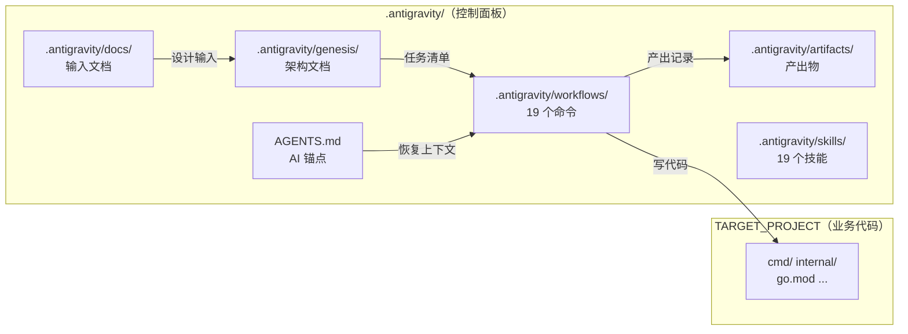
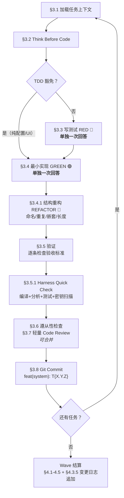

# Antigravity Workflow Template — 完整使用指南

> **AI 驱动的软件工程工作区模板** — 通过文件系统即外部记忆 + 工作流约束 + 自动验证管线，
> 让 AI 从"聪明但不靠谱的实习生"变成"严谨可靠的工程师"。

---

## 一句话定位

**这是一个 AI 工程控制面板**：你负责决策，AI 负责执行，文件系统负责记忆。

---

## 架构全景



### 目录结构

```text
your-project/                         ← 工作区根目录（同时也是 TARGET_PROJECT）
├── AGENTS.md                         ← AI 锚点，每次新会话第一个读的文件
├── .antigravity/                     ← 控制面板（所有管理文件都在这里）
│   ├── workflows/                    ← 19 个工作流定义
│   ├── skills/                       ← 19 个原子技能
│   ├── genesis/                      ← 版本化架构文档（初始为空，/genesis 后创建 v1/）
│   ├── docs/                         ← 你的输入：设计文档、需求文档
│   ├── artifacts/                    ← AI 产出物：计划、错误日志、PRP 蓝图
│   ├── examples/                     ← 代码模式示例
│   └── scripts/                      ← 一致性检查脚本
├── cmd/                              ← 业务代码（由框架或你自己创建）
├── internal/
├── go.mod
└── ...
```

> **默认状态**：新项目的 `.antigravity/genesis/` 是空的，这是正常状态。首次运行 `/genesis` 后才创建 `v1/`。
>
> **TARGET_PROJECT**：默认为 `./`（工作区根目录）。如需指向外部项目，在 AGENTS.md 中修改。
>
> **执行规则**：所有代码类 workflow 在动手前，都会先解析 `TARGET_PROJECT`、校验目标目录、回显路径。

---

## 移植到新项目

```bash
# 只需复制两样东西到你的项目根目录
cp AGENTS.md          your-project/
cp -r .antigravity/   your-project/

# PowerShell 等效命令
Copy-Item "AGENTS.md" "your-project\"
Copy-Item -Recurse ".antigravity" "your-project\"
```

---

## 架构来源

| 框架 | 贡献 |
|------|------|
| **ANWS** (Antigravity Workflow System) | 版本化架构、genesis 设计流程、Wave 分批执行 |
| **ECC** (Everything Claude Code) | 编码规范（动态生成）、TDD/Code Review、error journal |
| **Context Engineering** | PRP 蓝图生成/执行、`.antigravity/examples/` 代码示例、AI 行为法则 |
| **Antigravity Kit** | `/debug` 调试、`/deploy` 部署、`/status` 状态、苏格拉底门控 |
| **Harness Engineering** | 分层验证管线、Prevention Rules、Skill 加载法则 |

---

## 图例说明

| 标记 | 含义 |
|:----:|------|
| 🧑 | **你手动操作/触发** — 需要你输入命令或放文件 |
| 🤖 | **AI 自动执行** — 你说一句话，AI 全自动跑完 |
| ⏸️ | **人类检查点** — AI 停下来等你确认后才继续 |

---

## 全生命周期流程

```
.antigravity/docs/ 放入架构文档
    ↓
/genesis → PRD + 架构 + ADR + 架构速查 + 代码规范     ← 设计阶段
    ↓
/design-system → 系统详设（可选）
    ↓
/blueprint → 任务清单 + Sprint 规划                    ← 规划阶段
    ↓
/forge → Wave 分批编码 + 变更日志追加                   ← 编码阶段
    ↓
/deploy → 验证 + 构建 + 部署                           ← 部署阶段
    ↑                                              ↓
/debug /build-fix /change                    /status /code-review
    ← 日常维护 →                             ← 监控审查 →
```

---

## 场景 1：从零创建新项目

### Phase 0: 准备

| 步骤 | 操作 | 触发 |
|:----:|------|:----:|
| 0.1 | 复制 `AGENTS.md` + `.antigravity/` 到项目根目录 | 🧑 |
| 0.2 | 把架构文档（PDF/MD）放入 `.antigravity/docs/` | 🧑 |
| 0.3 | （可选）把代码示例放入 `.antigravity/examples/` | 🧑 |
| 0.4 | 在 IDE 中打开工作区 | 🧑 |

### Phase 1: 创世 — `/genesis`

> 🧑 你说：`请阅读 AGENTS.md，然后阅读 .antigravity/docs/ 下的设计文档，运行 /genesis`
>
> 首次运行时，AI 会创建 `.antigravity/genesis/v1/`。

| 步骤 | 操作 | 触发 | 产出 |
|:----:|------|:----:|------|
| 0 | 版本管理 — 创建 `.antigravity/genesis/v1/` 目录 | 🤖 | `00_MANIFEST.md`, `06_CHANGELOG.md` |
| 1 | 需求澄清 — 提取领域概念 | 🤖 | `concept_model.json` |
| 1.1 | AI 可能追问领域术语 | ⏸️ | — |
| 2 | PRD 生成 — 撰写产品需求 | 🤖 | `01_PRD.md` |
| 2.1 | **⏸️ 人类检查点 #1** — 确认 Goals 和 User Stories | ⏸️ | — |
| 3 | 技术选型 — 12 维度评估 | 🤖 | `03_ADR/ADR_001_TECH_STACK.md` |
| **3.5** | **架构提炼与代码规范** — 从 `docs/` 提炼速查文档 | 🤖 | `07_ARCHITECTURE_CHEATSHEET.md`, `08_CODING_STANDARDS.md` |
| 3.5.1 | **⏸️** 与用户讨论架构要点 | ⏸️ | — |
| 4 | 系统拆解 — 识别系统边界 | 🤖 | `02_ARCHITECTURE_OVERVIEW.md` |
| 4.1 | **⏸️ 人类检查点 #2** — 确认系统拆分合理性 | ⏸️ | — |
| 5 | （可选）架构决策 — 记录 ADR | 🤖 | `03_ADR/ADR_00X_*.md` |
| 6 | （可选）复杂度审计 | 🤖 | 审计报告 |
| 7 | 完成总结 — 更新 AGENTS.md | 🤖 | AGENTS.md 更新 |

> **Step 3.5 说明**：这一步从你的原始架构文档中提炼出两个速查文档，供后续 `/forge` 编码时作为 L0 必读上下文。
> 后续 genesis 迭代时（v{N+1}），会自动对比原始文档检查一致性，防止架构漂移。

### Phase 2: 系统详设 — `/design-system`（按需）

> 🧑 你说：`/design-system backend-api-system`

| 步骤 | 操作 | 触发 | 产出 |
|:----:|------|:----:|------|
| 1 | 上下文加载 — 读取 PRD + Architecture + ADR | 🤖 | — |
| 2 | 系统理解 — 深度思考系统边界 | 🤖 | — |
| 3 | 调研 — 搜索业界最佳实践 | 🤖 | `_research/{system}-research.md` |
| 4 | 设计 — 架构、接口、数据模型、Trade-offs | 🤖 | — |
| 5 | 文档化 — 产出设计文档 | 🤖 | `04_SYSTEM_DESIGN/{system}.md` |
| 6 | **⏸️ 人类检查点** — 确认系统设计 | ⏸️ | — |

> 💡 每个复杂系统建议在独立会话中设计。简单项目可跳过。

### Phase 3: 任务规划 — `/blueprint`

> 🧑 你说：`/blueprint`

| 步骤 | 操作 | 触发 | 产出 |
|:----:|------|:----:|------|
| 1 | 加载架构文档 | 🤖 | — |
| 2 | 任务拆解 — WBS 方法，每个 task 2-8h | 🤖 | 任务列表 |
| 3 | Sprint 路线图 — 退出标准 + 集成验证任务 | 🤖 | Sprint 表 |
| 4 | 依赖分析 — Mermaid 图 | 🤖 | 依赖图 |
| 5 | User Story 交叉验证 — 覆盖率安全网 | 🤖 | User Story Overlay |
| 6 | 生成文档 + 更新 AGENTS.md | 🤖 | `05_TASKS.md` |
| 7 | **⏸️ 人类检查点** — 确认任务清单 | ⏸️ | — |

### Phase 4: 编码执行 — `/forge`

> 🧑 你说：`/forge`

**每个 Wave（2-5 个任务）的执行循环：**

| 步骤 | 操作 | 触发 |
|:----:|------|:----:|
| 0 | 恢复定位 — 读 Wave 块 + Tasks 状态 | 🤖 |
| 1 | 波次规划 — 选任务 + ⏸️ 你确认 | 🤖 + ⏸️ |
| 2 | 加载文档（L0 架构速查+代码规范 → L1 系统设计 → L2 任务级） | 🤖 |

**每个 Task 的执行循环：**

| 步骤 | 操作 | 触发 | 说明 |
|:----:|------|:----:|------|
| **§3.1** | 加载任务级上下文 | 🤖 | 读 task 描述、验收标准 |
| **§3.2** | Think Before Code | 🤖 | 想清楚再写 |
| **§3.3** | 测试先行 (RED) | 🤖 | 写测试 → 确认失败。**单独一次回答** |
| | ↳ TDD 豁免：纯配置/UI/文档 | 🤖 | 可跳过 §3.3 |
| **§3.4** | 最小实现 (GREEN) | 🤖 | 只写让测试通过的代码。**单独一次回答** |
| **§3.4.1** | 结构重构 (REFACTOR) | 🤖 | 命名/重复/嵌套/长度，不做性能优化 |
| **§3.5** | 验证 | 🤖 | 逐条检查验收标准 |
| **§3.5.1** | Harness Quick Check | 🤖 | 编译+分析+测试+密钥扫描 |
| **§3.6** | 遵从性检查 | 🤖 | 7 项 checklist |
| **§3.7** | 轻量 Code Review | 🤖 | 4 项安全扫描 |
| **§3.8** | 提交 | 🤖 | git commit + 回写进度 |

**Wave 结算：**

| 步骤 | 操作 | 触发 |
|:----:|------|:----:|
| §4.1-4.3 | 波次结算 + 更新 AGENTS.md | 🤖 |
| **§4.3.5** | **变更日志追加** — 追加波次变更摘要到 `06_CHANGELOG.md` | 🤖 |
| §4.4 | 性能审视（跑 benchmark → 识别瓶颈 → 记录优化任务） | 🤖 |
| §4.5 | **⏸️** 你确认波次完成 | ⏸️ |

**里程碑结算（Sprint 完成时）：**

| 步骤 | 操作 | 触发 |
|:----:|------|:----:|
| 5.1 | Harness Full Verification（L3） | 🤖 |
| 5.2 | Integration Tests（L4） | 🤖 |
| 5.3 | 完整 `/code-review [scope]` | 🧑 |

### Phase 5: 部署 — `/deploy`

> 🧑 你说：`/deploy production`

| 步骤 | 操作 | 触发 |
|:----:|------|:----:|
| 1 | Harness 自动验证（Full + Security + Integration） | 🤖 |
| 2 | 预部署检查清单 | ⏸️ |
| 3 | 构建 | 🤖 |
| 4 | 部署 | 🤖 |
| 5 | Shadow Mode（生产环境推荐，30min 观察） | ⏸️ |
| 6 | 健康检查 | 🤖 |
| 7 | 部署报告 | 🤖 |

---

## 场景 2：给已有项目加功能（最常用）

项目已经完成首次 `/genesis` + `/blueprint`，正在开发中。

### 路线 A：功能在任务清单内

```
🧑 你说：/forge
```

AI 自动从上次断点继续（通过 AGENTS.md Wave 块 + Tasks checkbox 恢复），执行 TDD 循环。

### 路线 B：新功能（轻量规划）⭐ 最常用

```
🧑 你说：/plan 新增评论功能
    ↓
🤖 产出 implementation_plan.md → ⏸️ 你确认
    ↓
🧑 按计划实现，遵循 /forge 的任务循环
    ↓
🤖 每个任务走完整 §3.1-3.8 循环
    ↓
🧑 /code-review HEAD~3..HEAD
    ↓
🤖 对该提交范围做 8 项审查 → 你通过 walkthrough 人工审查
```

### 路线 C：复杂功能（详尽蓝图）

```
🧑 你说：/generate-prp 新增 WebSocket 实时通知
    ↓
🤖 生成 PRP 蓝图（含验证门控） → ⏸️ 你确认
    ↓
🧑 /execute-prp .antigravity/artifacts/prp_websocket.md
    ↓
🤖 按蓝图逐步实现 + 每步验证
```

---

## 场景 3：日常维护

| 你想做什么 | 命令 | AI 做什么 |
|----------|------|----------|
| 遇到 Bug | `/debug 描述` | 假设驱动调试 → 修复 → 记录 error_journal |
| 构建失败 | `/build-fix` | 诊断 → 修复 → 验证 |
| 微调任务 | `/change T2.1.3 改为 RBAC` | 更新 Tasks + Changelog |
| 查看进度 | `/status` | 输出项目状态卡 |
| 审查代码 | `/code-review [scope]` | 8 项检查 + 报告 |
| 重大重构 | `/genesis` | 创建 v{N+1}，演进架构 |
| 接手老项目 | `/scout` | 探测风险、暗坑和耦合 |
| 技术调研 | `/explore 主题` | 向外搜索 + 向内发散，产出洞察 |
| 质疑架构 | `/challenge` | 系统性质疑现有决策 |

---

## 核心循环：forge 任务执行详解



### 两层 REFACTOR 策略

| 层 | 时机 | 优化什么 | 驱动方式 |
|---|------|---------|---------|
| **结构重构** §3.4.1 | 每个 task 的 GREEN 之后 | 命名、重复代码、嵌套、长度 | 代码本身 |
| **性能优化** §4.4 | Wave 结算时 | 延迟、内存、并发瓶颈 | benchmark 数据 |

- 结构重构**每次都做**，不积累
- 性能优化**靠数据不靠猜**，发现问题后创建独立优化任务

---

## 四层验证管线（Harness Engineering）

> **核心理念**：验证不靠 AI 自律，靠系统强制。

| 层级 | 名称 | 何时跑 | 说明 |
|:----:|------|--------|------|
| L1 | Quick Check | 每个 task 后 | 编译 + 静态分析 + 短测试 + 密钥扫描 |
| L2 | Security Gate | 每次 commit 前 | 硬编码密钥 + 注入检测 + 错误泄露检查 |
| L3 | Full Verification | deploy 前 | Lint + Race 检测 + Coverage + 依赖审计 |
| L4 | Integration Tests | Wave 完成后 | 需要外部依赖（DB/Cache/MQ 等） |

---

## 上下文恢复机制

AI **没有跨会话记忆**，但进度不会丢失：

| 恢复层 | 文件 | 粒度 | 恢复速度 |
|-------|------|------|---------|
| 项目地图 | AGENTS.md | 全局 | 5 秒 |
| 波次状态 | AGENTS.md Wave 块 | Wave 级 | 5 秒 |
| 任务进度 | 05_TASKS.md checkbox | Task 级 | 10 秒 |
| 已知错误 | error_journal.md | 错误级 | 10 秒 |
| 代码历史 | Git log + Task ID | Commit 级 | 按需 |

### 30 秒恢复协议

新会话只需读 AGENTS.md → Tasks → error_journal → 开始工作。

**推荐起手 prompt**：

```
请先阅读 AGENTS.md，确认 TARGET_PROJECT 配置正确；
如果当前还没有活动架构版本，就基于 .antigravity/docs/ 下的文档运行 /genesis。
```

---

## Git 恢复能力

每个 task 独立 commit 且 message 包含 Task ID，可以精确回退：

| 场景 | 命令 |
|------|------|
| 查看某个任务的变更 | `git log --oneline --grep="T{X.Y.Z}"` |
| 回退某个任务 | `git revert <commit-hash>` |
| 回退到某个 Wave 前 | `git reset --hard <hash>`（⚗️ 破坏性） |
| push 后安全回退 | `git revert <hash>` + `git push` |
| 查看某版本架构 | 直接读 `.antigravity/genesis/v{N}/` |

---

## 输出节制策略

> AI 假设每次输出 token 都是有限的。
> 目的不是拆成单独对话，而是确保重要环节不因贪多而含糊。

| 任务类型 | 策略 | 原因 |
|---------|------|------|
| 写测试（§3.3） | **单独一次回答** | 确保深度和准确性 |
| 写实现（§3.4） | **单独一次回答** | 确保代码质量 |
| 写 plan / 架构文档 | **单独一次回答** | 确保规划完整 |
| 架构提炼（Step 3.5） | **单独一次回答** | 速查文档需要精准 |
| 系统详设（/design-system） | **单独一次回答** | 设计需要深度思考 |
| 完整 Code Review | **单独一次回答** | 审查需要全面性 |
| Debug 根因分析 | **单独一次回答** | 假设验证需严谨 |
| 遵从性+Review+Commit | 可合并一次执行 | 轻量检查类 |
| 波次规划+文档加载 | 可合并一次执行 | 准备类 |

---

## Error Self-Evolution — 错误自进化

遇到 bug 或走错方向时：

1. 记录到 `.antigravity/artifacts/error_journal.md`（含根因和防范规则）
2. 每次行动前扫描 Prevention Rules 速查表
3. 系统自动积累"免疫力"

---

## 全部 19 个命令速查

### 架构设计（来自 ANWS）

| 命令 | 一句话 | 使用场景 |
|------|--------|---------|
| `/quickstart` | 不知道从哪开始？从这里 | 新用户入口 |
| `/genesis` | 完整设计流程（PRD → 架构 → ADR → 速查） | 新项目 / 重大重构 |
| `/scout` | 探测风险、暗坑和耦合 | 接手老项目 / 变更前 |
| `/design-system {系统}` | 为某个系统设计详细架构 | 复杂系统 |
| `/blueprint` | 把架构拆成可执行的任务清单 | genesis 后 |
| `/change` | 微调已有任务 | 需求变更 |
| `/explore` | 深度探索（向外搜索 + 向内发散） | 技术调研 / 选型 |
| `/challenge` | 系统性质疑现有架构决策 | 决策前 |
| `/craft` | 创建新的工作流/技能/提示词 | 扩展模板 |

### 编码质量（来自 ECC）

| 命令 | 一句话 | 使用场景 |
|------|--------|---------|
| `/forge` | 按任务清单分 Wave 编码（**主力工作流**） | 日常开发 |
| `/plan` | 轻量级功能规划 | 加新功能 |
| `/tdd` | 先写测试再实现 | 单个模块开发 |
| `/code-review [scope]` | 8 项代码审查 | Wave 结束 / 功能完成 |
| `/build-fix` | 构建失败修复 | 编译报错 |

### Context Engineering

| 命令 | 一句话 | 使用场景 |
|------|--------|---------|
| `/generate-prp` | 生成详尽的实现蓝图（含验证门控） | 复杂新功能 |
| `/execute-prp` | 按蓝图逐步实现+验证 | PRP 确认后 |

### 运维与调试（来自 Kit）

| 命令 | 一句话 | 使用场景 |
|------|--------|---------|
| `/debug` | 假设驱动的系统化调试 | 遇到 Bug |
| `/deploy` | Harness 验证 → 构建 → 部署 → 健康检查 | 上线 |
| `/status` | 项目全景状态卡 | 随时查看 |

### 工作流决策指南

| 场景 | 用哪个 |
|------|--------|
| 从零开始一个全新项目 | `/genesis` |
| 给现有项目加一个新功能 | `/plan` 或 `/generate-prp` |
| 重大重构 | `/genesis`（新建 v{N+1}） |
| 小需求微调 | `/change` |
| 遇到 bug | `/debug` |
| 构建失败 | `/build-fix` |
| 部署上线 | `/deploy` |
| 查看进度 | `/status` |

---

## 宪法规则（20 条）

| # | 规则 | 来源 |
|---|------|------|
| 1 | 版本即法律 — 架构文档只演进不修补 | ANWS |
| 2 | 显式上下文 — 决策写入 ADR | ANWS |
| 3 | 交叉验证 — 编码前对照任务清单 | ANWS |
| 4 | Plan Before Execute — 先规划再编码 | ECC |
| 5 | Test-Driven — 先写测试再实现，80%+ 覆盖率 | ECC |
| 6 | Security-First — 绝不硬编码密钥 | ECC |
| 7 | Small Files — 函数≤50行，文件≤800行 | ECC |
| 8 | 不假设缺失的上下文 | CE |
| 9 | 不编造不存在的 API | CE |
| 10 | 参考 `.antigravity/examples/` | CE |
| 11 | 验证不可跳过 | CE |
| 12 | Declare Before Act — 使用 Skill 前先声明 | Harness |
| 13 | Cross-Reference — 实现前检查 `.antigravity/examples/` | Harness |
| 14 | Socratic Gate — 新功能先问 3 个问题 | Kit |
| 15 | Token 节约 — 每次只输出当前步骤必要内容 | Output |
| 16 | 重要任务单独执行 — 写测试/写实现/plan 必须单独一次回答 | Output |
| 17 | 轻量任务可合并 — 检查/review/commit 可同次执行 | Output |
| 18 | Socratic Gate — Bug 先确认影响范围 | Kit |
| 19 | Socratic Gate — 模糊请求先问目的 | Kit |
| 20 | Error Self-Evolution — 错误记录到 journal + Prevention Rules | ECC |

---

## 常见误区

| 误区 | 正确理解 |
|------|---------|
| `.antigravity/genesis/` 目录存在 = 项目已初始化 | ❌ 空目录不算。需要有效的 `v{N}/00_MANIFEST.md` |
| `/forge` 可以不经过 `/genesis` 直接开始 | ❌ 正常顺序：`/genesis` → `/blueprint` → `/forge` |
| 每个 genesis 版本会覆盖旧版本 | ❌ v1, v2, v3 共存，是架构演进历史 |
| 代码应该写在 `.antigravity/` 里面 | ❌ 业务代码写在 TARGET_PROJECT（默认 `./`） |

---

## 你需要做的 vs AI 做的

| 你的动作 | 频率 |
|---------|------|
| 放入架构文档 → `.antigravity/docs/` | 项目初始化时一次 |
| 输入命令（`/genesis` 等） | 每个阶段一次 |
| 确认检查点（⏸️） | 每个阶段 1-2 次 |
| 通过 walkthrough 人工 code review | Wave 结束后 |
| 决定是否重置上下文 | 对话太长 / AI 跑偏时 |

**其余全部由 AI 自动执行。**

---

## 判断项目当前状态

看 3 个信号：

1. `AGENTS.md` 的"最新架构版本"是否还是 `尚未初始化`
2. 是否存在有效的 `.antigravity/genesis/v{N}/00_MANIFEST.md`
3. 是否已经有对应版本的 `05_TASKS.md`

---

## 一致性检查

发布或合并模板改动前，运行：

```bash
bash .antigravity/scripts/check-template-consistency.sh
```

---

## License

MIT
